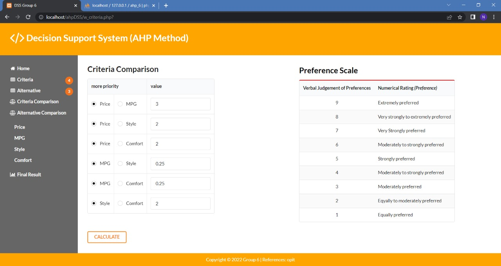
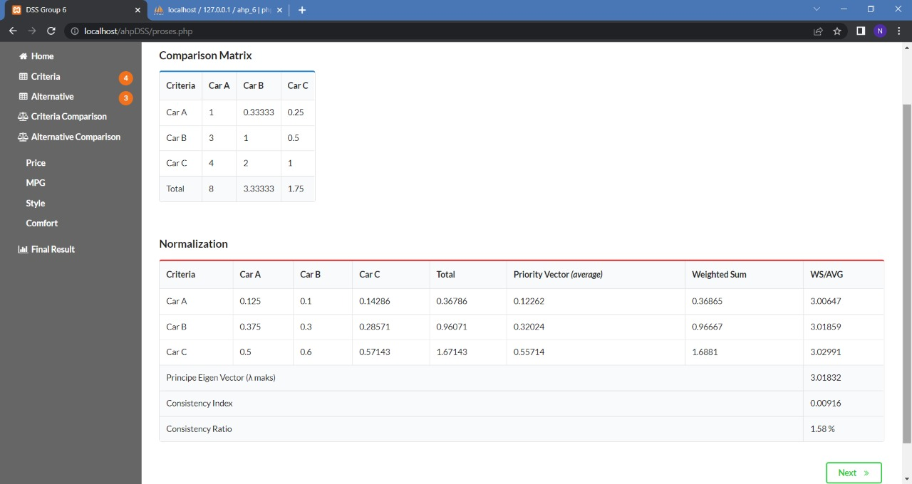

# Analytic-Hierarchy-Process
Simple decision support system application with AHP method.

## Installation
- create new database in MySQL server (phpMyAdmin)
- edit file config.php
- import database(.sql) into your new database
- run your website

## Screenshot
- Home Page

- Criteria

- Alternative

- Add and Edit Page

- Input Value of Criteria

- Normalization of Criteria

- Input Value of Alternative

- Normalization of Alternative

- Final Result

 
